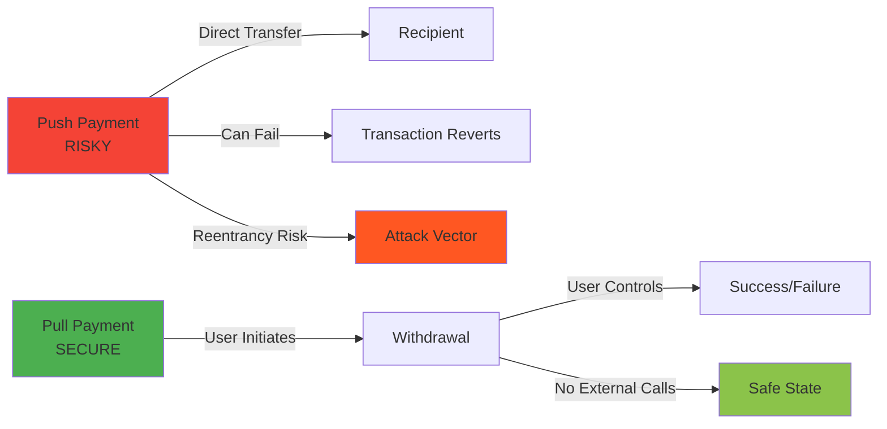
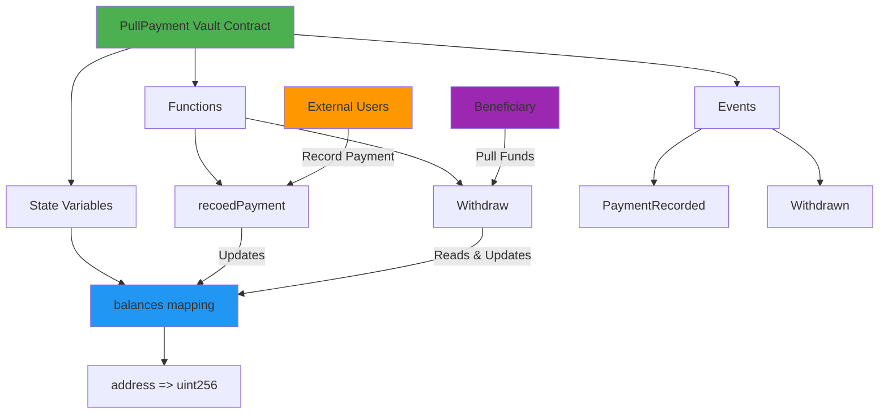
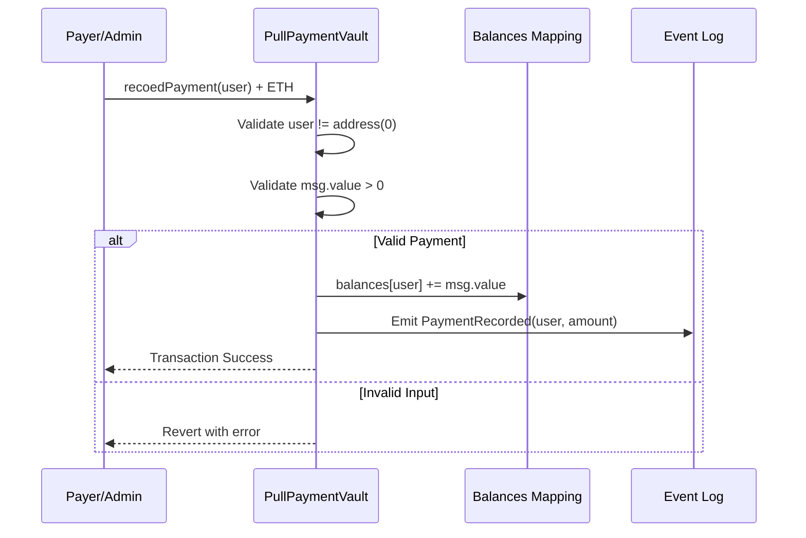
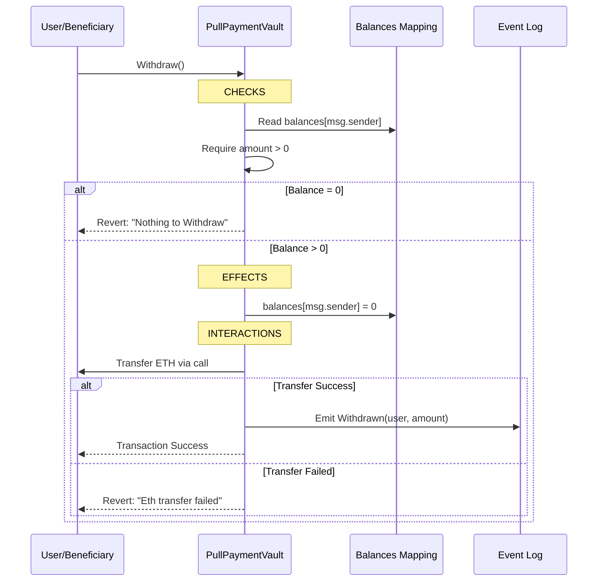
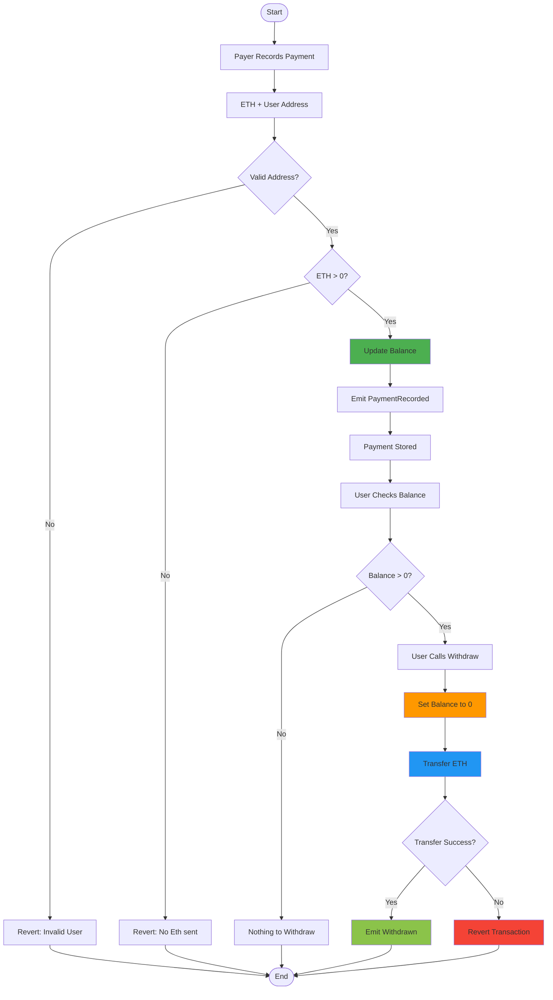
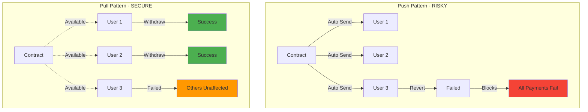
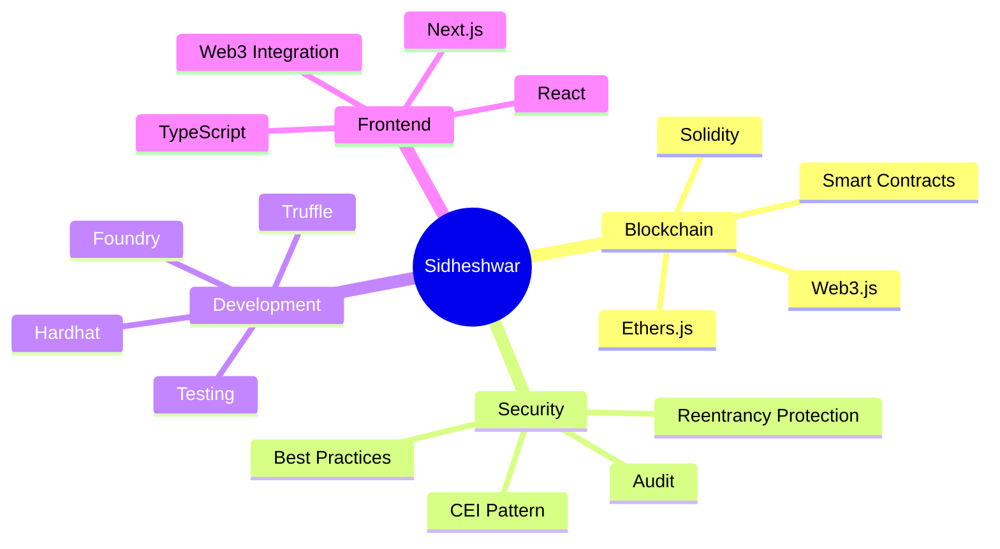

# PullPayment Vault Smart Contract

<div align="center">
  <a href="https://docs.soliditylang.org/en/v0.8.20/"></a>
  <a href="https://hardhat.org/"></a>
  <a href="https://opensource.org/licenses/MIT"></a>
  <a href="https://hardhat.org/hardhat-network/docs"></a>
  <a href="https://fravoll.github.io/solidity-patterns/pull_over_push.html"></a>
  <a href="https://ethereum.org/"></a>
</div>

<div align="center">
  <h3>A secure Pull Payment pattern implementation for safe fund distribution</h3>
  <p>Prevents reentrancy attacks and ensures users control their own withdrawals</p>
  
  <br>
  
  <a href="#overview">Overview</a> •
  <a href="#features">Features</a> •
  <a href="#getting-started">Getting Started</a> •
  <a href="#deployment">Deployment</a> •
  <a href="#usage-examples">Usage</a> •
  <a href="#security-analysis">Security</a> •
  <a href="#author">Author</a>
  
  <br><br>
  
  
  
  
</div>

---

## Table of Contents

- [Overview](#overview)
- [Features](#features)
- [Pull Payment Pattern](#pull-payment-pattern)
- [Architecture](#architecture)
- [Workflow](#workflow)
- [Getting Started](#getting-started)
- [Contract Details](#contract-details)
- [Deployment](#deployment)
- [Usage Examples](#usage-examples)
- [Security Analysis](#security-analysis)
- [Technology Stack](#technology-stack)
- [Use Cases](#use-cases)
- [Author](#author)
- [License](#license)

---

## Overview

The PullPayment Vault implements the **Pull Payment Pattern**, a security best practice in smart contract development. Instead of pushing payments directly to users (which can be vulnerable to reentrancy attacks), this contract allows users to safely withdraw their funds at their own convenience.

### Key Highlights

- **Pull Over Push**: Users withdraw funds themselves, eliminating push payment risks
- **Reentrancy Protected**: Follows Checks-Effects-Interactions pattern
- **Balance Tracking**: Maintains individual user balances using mappings
- **Flexible Payments**: Anyone can record payments for any user
- **Self-Service Withdrawals**: Users control when to withdraw their funds
- **Event-Driven**: Comprehensive logging for all operations

---

## Features

| Feature | Description |
|---------|-------------|
| **Payment Recording** | Record payments for any valid Ethereum address |
| **Individual Balances** | Track separate balances for each user |
| **Self-Withdrawal** | Users pull their own funds when ready |
| **Zero Address Check** | Prevents payments to invalid addresses |
| **Balance Validation** | Ensures withdrawals only when balance exists |
| **Reentrancy Safe** | Implements CEI pattern for security |
| **Event Emission** | Complete audit trail of all transactions |

---

## Pull Payment Pattern

### What is Pull Payment?

The Pull Payment pattern is a security design where recipients actively withdraw funds rather than having them automatically sent. This approach offers several advantages:

<div align="center">



</div>

### Advantages

1. **Security**: Eliminates reentrancy attack vectors
2. **Gas Efficiency**: Failed transfers don't affect other operations
3. **User Control**: Recipients decide when to withdraw
4. **Isolation**: One user's withdrawal issues don't impact others
5. **Predictability**: No unexpected external call failures

---

## Architecture

<div align="center">



</div>

### Contract Structure

```
PullPaymentVault
├── State Variables
│   └── balances (mapping: address => uint256)
├── Functions
│   ├── recoedPayment(address _user) payable
│   └── Withdraw()
└── Events
    ├── PaymentRecorded(address indexed user, uint256 amount)
    └── Withdrawn(address indexed user, uint256 amount)
```

---

## Workflow

### Payment Recording Flow

<div align="center">



</div>

### Withdrawal Flow (CEI Pattern)

<div align="center">



</div>

### Complete System Flow

<div align="center">



</div>

---

## Getting Started

### Prerequisites

Before you begin, ensure you have the following installed:

- **Node.js** (v16.0.0 or higher)
- **npm** or **yarn**
- **Git**
- **Hardhat**

### Installation

```bash
# Clone the repository
git clone https://github.com/Siddheshwar-cloud/pullpayment-vault.git
cd pullpayment-vault

# Install dependencies
npm install
```

### Project Structure

```
pullpayment-vault/
├── contracts/
│   └── PullPaymentVault.sol
├── scripts/
│   └── deploy.js
├── hardhat.config.js
├── package.json
└── README.md
```

---

## Contract Details

### State Variables

```solidity
mapping(address => uint256) public balances;
```

Maps each user address to their available balance for withdrawal.

---

### Functions

#### recoedPayment()

```solidity
function recoedPayment(address _user) external payable
```

Records a payment for a specific user. Can be called by anyone.

**Parameters:**
- `_user`: The address to receive the payment credit

**Requirements:**
- `_user` must not be the zero address
- `msg.value` must be greater than 0

**Effects:**
- Increases the user's balance by `msg.value`

**Events Emitted:**
- `PaymentRecorded(address indexed user, uint256 amount)`

**Example:**
```solidity
// Record 1 ETH payment for user
vault.recoedPayment(userAddress, { value: ethers.parseEther("1.0") });
```

---

#### Withdraw()

```solidity
function Withdraw() external
```

Allows users to withdraw their accumulated balance.

**Requirements:**
- Caller must have a balance greater than 0

**Effects:**
- Sets caller's balance to 0 before transfer (CEI pattern)
- Transfers entire balance to caller

**Events Emitted:**
- `Withdrawn(address indexed user, uint256 amount)`

**Example:**
```solidity
// User withdraws their balance
vault.Withdraw();
```

---

### Events

#### PaymentRecorded

```solidity
event PaymentRecorded(address indexed user, uint256 amount);
```

Emitted when a payment is recorded for a user.

**Parameters:**
- `user`: The beneficiary address
- `amount`: The amount credited in wei

---

#### Withdrawn

```solidity
event Withdrawn(address indexed user, uint256 amount);
```

Emitted when a user successfully withdraws funds.

**Parameters:**
- `user`: The address that withdrew funds
- `amount`: The amount withdrawn in wei

---

## Deployment

### Local Network Deployment

The contract is deployed on a local Hardhat network.

```bash
# Terminal 1: Start local Hardhat node
npx hardhat node

# Terminal 2: Deploy contract
npx hardhat run scripts/deploy.js --network localhost
```

### Deployment Output

```
PullPaymentVault deployed to: 0x5FbDB2315678afecb367f032d93F642f64180aa3
```

---

## Usage Examples

### Using Hardhat Console

```javascript
// Start Hardhat console
npx hardhat console --network localhost

// Get contract instance
const Contract = await ethers.getContractFactory("PullPaymentVault");
const vault = await Contract.attach("YOUR_CONTRACT_ADDRESS");

// Get signers
const [owner, user1, user2] = await ethers.getSigners();

// Record payment for user1 (1 ETH)
const tx1 = await vault.recoedPayment(user1.address, { 
  value: ethers.parseEther("1.0") 
});
await tx1.wait();
console.log("Payment recorded for user1");

// Check user1's balance
const balance = await vault.balances(user1.address);
console.log("User1 Balance:", ethers.formatEther(balance), "ETH");

// User1 withdraws their funds
const withdrawTx = await vault.connect(user1).Withdraw();
await withdrawTx.wait();
console.log("User1 withdrew successfully");

// Verify balance is now zero
const newBalance = await vault.balances(user1.address);
console.log("User1 New Balance:", ethers.formatEther(newBalance), "ETH");
```

---

### Complete Interaction Script

```javascript
const { ethers } = require("hardhat");

async function main() {
  // Deploy contract
  const PullPaymentVault = await ethers.getContractFactory("PullPaymentVault");
  const vault = await PullPaymentVault.deploy();
  await vault.waitForDeployment();
  
  console.log("Vault deployed to:", await vault.getAddress());
  
  // Get signers
  const [payer, user1, user2] = await ethers.getSigners();
  
  // Record payments for multiple users
  console.log("\n--- Recording Payments ---");
  
  await vault.recoedPayment(user1.address, { 
    value: ethers.parseEther("2.5") 
  });
  console.log("Recorded 2.5 ETH for User1");
  
  await vault.recoedPayment(user2.address, { 
    value: ethers.parseEther("1.8") 
  });
  console.log("Recorded 1.8 ETH for User2");
  
  // Check balances
  console.log("\n--- Checking Balances ---");
  const balance1 = await vault.balances(user1.address);
  const balance2 = await vault.balances(user2.address);
  
  console.log("User1 Balance:", ethers.formatEther(balance1), "ETH");
  console.log("User2 Balance:", ethers.formatEther(balance2), "ETH");
  
  // Users withdraw
  console.log("\n--- Withdrawals ---");
  
  await vault.connect(user1).Withdraw();
  console.log("User1 withdrew:", ethers.formatEther(balance1), "ETH");
  
  await vault.connect(user2).Withdraw();
  console.log("User2 withdrew:", ethers.formatEther(balance2), "ETH");
  
  // Verify final balances
  console.log("\n--- Final Balances ---");
  const finalBalance1 = await vault.balances(user1.address);
  const finalBalance2 = await vault.balances(user2.address);
  
  console.log("User1 Balance:", ethers.formatEther(finalBalance1), "ETH");
  console.log("User2 Balance:", ethers.formatEther(finalBalance2), "ETH");
}

main().catch((error) => {
  console.error(error);
  process.exitCode = 1;
});
```

---

### Event Monitoring Script

```javascript
const { ethers } = require("hardhat");

async function monitorEvents() {
  const vault = await ethers.getContractAt(
    "PullPaymentVault", 
    "YOUR_CONTRACT_ADDRESS"
  );
  
  // Listen for PaymentRecorded events
  vault.on("PaymentRecorded", (user, amount, event) => {
    console.log("\nPayment Recorded:");
    console.log("User:", user);
    console.log("Amount:", ethers.formatEther(amount), "ETH");
    console.log("Block:", event.log.blockNumber);
  });
  
  // Listen for Withdrawn events
  vault.on("Withdrawn", (user, amount, event) => {
    console.log("\nWithdrawal:");
    console.log("User:", user);
    console.log("Amount:", ethers.formatEther(amount), "ETH");
    console.log("Block:", event.log.blockNumber);
  });
  
  console.log("Monitoring events... Press Ctrl+C to stop");
}

monitorEvents();
```

---

## Security Analysis

### Checks-Effects-Interactions Pattern

The contract strictly follows the CEI pattern in the `Withdraw()` function:

<div align="center">

| Phase | Action | Purpose |
|-------|--------|---------|
| **CHECKS** | `require(amount > 0)` | Validates withdrawal conditions |
| **EFFECTS** | `balances[msg.sender] = 0` | Updates state before external call |
| **INTERACTIONS** | `msg.sender.call{value: amount}("")` | External interaction happens last |

</div>

### Security Features

#### 1. Reentrancy Protection

```solidity
// Balance zeroed BEFORE transfer
balances[msg.sender] = 0;  // EFFECT

// Transfer happens after state update
(bool success, ) = msg.sender.call{value: amount}("");  // INTERACTION
```

**Why This Matters:**
- Even if recipient is a malicious contract
- They cannot reenter and withdraw again
- Balance is already set to 0

---

#### 2. Address Validation

```solidity
require(_user != address(0), "Invalid User");
```

Prevents accidental ETH loss to zero address.

---

#### 3. Amount Validation

```solidity
require(msg.value > 0, "No Eth sent");
require(amount > 0, "Nothing to Withdraw");
```

Ensures meaningful transactions only.

---

#### 4. Transfer Safety

```solidity
(bool success, ) = msg.sender.call{value: amount}("");
require(success, "Eth transfer failed");
```

Checks transfer success and reverts on failure.

---

### Attack Vector Analysis

<div align="center">

| Attack Type | Vulnerability | Protection |
|-------------|---------------|------------|
| **Reentrancy** | LOW | CEI pattern enforced |
| **Integer Overflow** | NONE | Solidity 0.8.20 has built-in checks |
| **Access Control** | LOW | Users control own withdrawals |
| **DoS** | LOW | Individual balances isolated |
| **Front-Running** | LOW | No time-sensitive operations |

</div>

---

### Comparison: Push vs Pull Pattern

<div align="center">



</div>

---

## Technology Stack

<div align="center">

| Technology | Version | Purpose |
|------------|---------|---------|
| **Solidity** | ^0.8.20 | Smart contract language |
| **Hardhat** | Latest | Development framework |
| **Ethers.js** | v6 | Blockchain interaction |
| **Node.js** | v16+ | Runtime environment |

</div>

### Development Tools

- **Hardhat Network**: Local blockchain for development
- **Hardhat Console**: Interactive JavaScript environment
- **Solidity Compiler**: Contract compilation with optimization

---

## Use Cases

### 1. Payroll Distribution

```
Scenario: Company pays employees monthly

Process:
1. HR records payments for all employees
2. Each employee withdraws at their convenience
3. Failed withdrawal doesn't affect others
4. Clear audit trail via events

Benefits:
- Employees control withdrawal timing
- No failed batch payments
- Timezone-friendly
```

---

### 2. Freelancer Payments

```
Scenario: Platform for gig workers

Process:
1. Clients record payments for completed work
2. Freelancers withdraw when they need funds
3. Multiple clients can pay same freelancer
4. Accumulated balance grows automatically

Benefits:
- Freelancers consolidate withdrawals
- Reduced gas costs
- Flexible cash flow management
```

---

### 3. Affiliate/Commission System

```
Scenario: Marketing platform with referral rewards

Process:
1. System records commissions as they're earned
2. Affiliates check accumulated balance
3. Withdraw when threshold is reached
4. Transparent earning tracking

Benefits:
- Automated commission recording
- Self-service withdrawals
- Reduced operational overhead
```

---

### 4. Prize Distribution

```
Scenario: Gaming or competition platform

Process:
1. Winners receive prize allocations
2. Each winner withdraws independently
3. No coordination required
4. Prizes accumulate if multiple wins

Benefits:
- Simultaneous winner payouts
- No failed mass distributions
- Winners control timing
```

---

### 5. Dividend Distribution

```
Scenario: Token holder rewards

Process:
1. Contract receives dividend ETH
2. Proportional amounts recorded per holder
3. Holders withdraw at leisure
4. Unclaimed dividends remain available

Benefits:
- No gas wars during distribution
- Holders withdraw when gas is cheap
- Predictable contract behavior
```

---

## Advantages of Pull Payment Pattern

### For Users

- **Control**: Decide when to withdraw
- **Privacy**: Withdraw independently
- **Gas Optimization**: Choose low-gas periods
- **Safety**: No unexpected calls to their address

### For Developers

- **Security**: Eliminates reentrancy risks
- **Simplicity**: Cleaner code logic
- **Reliability**: No failed batch operations
- **Scalability**: No loops over user arrays

### For Applications

- **Predictability**: Deterministic gas costs
- **Isolation**: User issues don't cascade
- **Audibility**: Clear transaction history
- **Maintainability**: Easier to debug and upgrade

---

## Common Patterns & Best Practices

### Pattern: Multiple Payment Sources

```solidity
// Multiple payers can contribute to same user
recoedPayment(user, {value: amount1});  // From payer 1
recoedPayment(user, {value: amount2});  // From payer 2
// User's balance accumulates: amount1 + amount2
```

### Pattern: Batch Payment Recording

```javascript
// Record payments for multiple users
async function batchRecordPayments(vault, recipients, amounts) {
  for (let i = 0; i < recipients.length; i++) {
    await vault.recoedPayment(recipients[i], { 
      value: amounts[i] 
    });
  }
}
```

### Pattern: Balance Checking Before Withdrawal

```javascript
// Check balance before attempting withdrawal
const balance = await vault.balances(userAddress);
if (balance > 0) {
  await vault.connect(user).Withdraw();
} else {
  console.log("No balance to withdraw");
}
```

---

## Potential Enhancements

### Feature Ideas

1. **Partial Withdrawals**: Allow users to withdraw specific amounts
2. **Withdrawal Scheduling**: Set automatic withdrawal times
3. **Multi-Token Support**: Track balances of different ERC20 tokens
4. **Withdrawal Limits**: Implement daily/weekly withdrawal caps
5. **Emergency Pause**: Add circuit breaker for emergencies
6. **Whitelist/Blacklist**: Control who can receive payments
7. **Expiry Mechanism**: Return unclaimed funds after timeout
8. **Notification System**: Alert users of new payments

---

## Troubleshooting

### Common Issues

#### Issue: "Invalid User" error

**Solution:**
```javascript
// Ensure address is valid
const address = "0x742d35Cc6634C0532925a3b844Bc9e7595f0bEb";
await vault.recoedPayment(address, {value: amount});
```

#### Issue: "Nothing to Withdraw" error

**Solution:**
```javascript
// Check balance first
const balance = await vault.balances(userAddress);
console.log("Available:", ethers.formatEther(balance));
```

#### Issue: "Eth transfer failed" error

**Possible Causes:**
- Recipient is a contract without receive/fallback function
- Recipient's receive function reverts
- Out of gas

**Solution:**
```javascript
// Ensure recipient can receive ETH
// If recipient is contract, implement:
receive() external payable {}
```

---

## FAQ

**Q: Can users lose their funds?**
A: No, balances are tracked on-chain and persist until withdrawn.

**Q: What happens if withdrawal fails?**
A: Transaction reverts, balance remains unchanged, user can retry.

**Q: Can the contract owner steal funds?**
A: No, there's no owner privilege. Users control their own withdrawals.

**Q: Is there a withdrawal deadline?**
A: No, funds remain available indefinitely.

**Q: Can I withdraw someone else's balance?**
A: No, you can only withdraw your own balance (msg.sender).

**Q: What if I send ETH directly to the contract?**
A: It won't be credited to anyone's balance. Use `recoedPayment()`.

---

## Gas Optimization Tips

### For Payment Recording

```javascript
// Batch recordings in single transaction when possible
// More efficient than multiple separate transactions
```

### For Withdrawals

```javascript
// Withdraw during low-gas periods
// Check gas prices: await ethers.provider.getFeeData()
```

### For Monitoring

```javascript
// Use events instead of constant balance queries
// Events are cheaper and provide historical data
```

---

## Author

<div align="center">
  
  
  
  
</div>

<br>

<div align="center">
  
</div>

<br>

<table align="center">
  <tr>
    <td align="center" width="200">
      
      <br><strong>GitHub</strong>
      <br><a href="https://github.com/Siddheshwar-cloud">@Siddheshwar-cloud</a>
    </td>
    <td align="center" width="200">
      
      <br><strong>LinkedIn</strong>
      <br><a href="https://www.linkedin.com/in/sidheshwar-yengudle-113882241/">Connect with me</a>
    </td>
    <td align="center" width="200">
      
      <br><strong>Twitter</strong>
      <br><a href="https://x.com/SYangudale">@SYangudale</a>
    </td>
  </tr>
</table>

<div align="center">
  
  <br>
  
  [](https://github.com/Siddheshwar-cloud)
  [](https://www.linkedin.com/in/sidheshwar-yengudle-113882241/)
  [](https://x.com/SYangudale)

</div>

<br>

<div align="center">

### Skills & Expertise


</div>

<br>

<div align="center">



</div>

<br>

<div align="center">

### Let's Build the Decentralized Future Together!

**Open for collaborations, consultations, and exciting blockchain projects**

[](mailto:sidheshwar.yengudle@example.com)

</div>

---

## Show Your Support

If you found this project helpful or learned something new about the Pull Payment pattern, please consider giving it a star!

<div align="center">
  
[](https://github.com/Siddheshwar-cloud/pullpayment-vault)

<a href="https://github.com/Siddheshwar-cloud/pullpayment-vault">
  
</a>

**Your star helps others discover secure smart contract patterns!**

</div>

### Why Star This Repository?

<div align="center">

| Benefit | Impact |
|---------|--------|
| **Visibility** | Helps other developers find this security pattern |
| **Motivation** | Encourages creation of more educational content |
| **Community** | Builds a network of security-conscious developers |
| **Recognition** | Shows appreciation for open-source contributions |

</div>

### How to Support This Project

<div align="center">


</div>

1. **Star the Repository**: Click the star button at the top right
2. **Fork the Project**: Create your own copy to experiment
3. **Share on Social Media**: Help others discover secure patterns
4. **Follow on GitHub**: Stay updated with new projects
5. **Provide Feedback**: Open issues with suggestions

### Repository Links

<div align="center">

[](https://github.com/Siddheshwar-cloud/pullpayment-vault)
[](https://github.com/Siddheshwar-cloud/pullpayment-vault/fork)
[](https://github.com/Siddheshwar-cloud/pullpayment-vault/issues)
[](https://github.com/Siddheshwar-cloud/pullpayment-vault/pulls)

</div>

---

## Contributing

Contributions, issues, and feature requests are welcome!

### How to Contribute

1. Fork the project
2. Create your feature branch (`git checkout -b feature/SecurityEnhancement`)
3. Commit your changes (`git commit -m 'Add security feature'`)
4. Push to the branch (`git push origin feature/SecurityEnhancement`)
5. Open a Pull Request

### Contribution Ideas

- Add comprehensive test suite
- Implement partial withdrawal feature
- Add multi-token support
- Create frontend interface
- Improve gas optimization
- Enhance documentation

---

## License

This project is licensed under the **MIT License**.

```
MIT License

Copyright (c) 2024 Sidheshwar Yengudle

Permission is hereby granted, free of charge, to any person obtaining a copy
of this software and associated documentation files (the "Software"), to deal
in the Software without restriction, including without limitation the rights
to use, copy, modify, merge, publish, distribute, sublicense, and/or sell
copies of the Software, and to permit persons to whom the Software is
furnished to do so, subject to the following conditions:

The above copyright notice and this permission notice shall be included in all
copies or substantial portions of the Software.

THE SOFTWARE IS PROVIDED "AS IS", WITHOUT WARRANTY OF ANY KIND, EXPRESS OR
IMPLIED, INCLUDING BUT NOT LIMITED TO THE WARRANTIES OF MERCHANTABILITY,
FITNESS FOR A PARTICULAR PURPOSE AND NONINFRINGEMENT.
```

---

## References & Learning Resources

### Security Patterns

- [Consensys Smart Contract Best Practices](https://consensys.github.io/smart-contract-best-practices/)
- [OpenZeppelin Security Guidelines](https://docs.openzeppelin.com/contracts/)
- [Solidity Security Considerations](https://docs.soliditylang.org/en/latest/security-considerations.html)

### Pull Payment Pattern

- [Ethereum Pull Payment Pattern](https://fravoll.github.io/solidity-patterns/pull_over_push.html)
- [Checks-Effects-Interactions Pattern](https://docs.soliditylang.org/en/latest/security-considerations.html#use-the-checks-effects-interactions-pattern)

---

<div align="center">
  <p>Made with dedication to smart contract security by <strong>Sidheshwar Yengudle</strong></p>
  <p>Deployed on Local Hardhat Network</p>
  <p>Implementing Industry-Standard Security Patterns</p>
  
  **Secure Smart Contracts, Safer Blockchain!**
</div>
